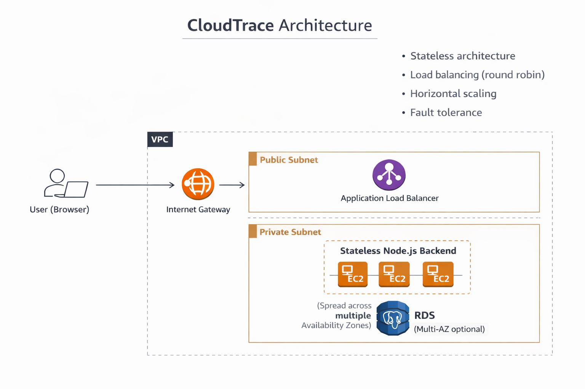

# ☁️ CloudTrace - Enterprise Load Balanced Request Tracking System

[](https://nodejs.org/)
[](https://www.postgresql.org/)
[](https://aws.amazon.com/)

> **Production-ready demonstration of stateless architecture, horizontal scaling, and cloud-native system design on AWS.**

---

## 🎯 Overview

CloudTrace is a full-stack application that tracks HTTP requests through a load-balanced, multi-server architecture. Each request is logged with the specific server that handled it, demonstrating real-time load distribution and system behavior.

### Architecture

```
User → ALB → EC2 Instances (Auto Scaling) → PostgreSQL (RDS)
```




### Key Features

- ✅ **Stateless Architecture** - Zero local state, all data in shared database
- ✅ **Load Balancing** - Automatic request distribution via AWS ALB
- ✅ **Horizontal Scaling** - Auto Scaling Group manages EC2 instances
- ✅ **Fault Tolerance** - Automatic failover on server failure
- ✅ **Production-Ready** - Error handling, retry logic, connection pooling

---

## 🏗️ System Architecture

### Technology Stack

| Component | Technology |
|-----------|-----------|
| Frontend | HTML5, CSS3, Vanilla JavaScript |
| Backend | Node.js (Native HTTP) |
| Database | PostgreSQL |
| Load Balancer | AWS Application Load Balancer |
| Compute | AWS EC2 (Auto Scaling Group) |
| Database Service | AWS RDS PostgreSQL |
| Infrastructure | AWS VPC, Security Groups, Subnets |

### Design Principles

1. **Stateless Design** - No session data, no local files, all state in database
2. **High Availability** - Multiple EC2 instances with health checks
3. **Scalability** - Horizontal scaling via Auto Scaling Group
4. **Reliability** - Connection pooling, retry logic, transaction management

---

## 🚀 Quick Start

### Prerequisites

- Node.js v14+
- PostgreSQL 12+
- AWS Account (for deployment)

### Local Setup

1. **Database Setup:**
   ```sql
   CREATE DATABASE cloudtrace;
   CREATE USER cloudtrace WITH PASSWORD 'password';
   GRANT ALL PRIVILEGES ON DATABASE cloudtrace TO cloudtrace;
   ```

2. **Run Schema:**
   ```bash
   psql -U cloudtrace -d cloudtrace -f db/schema.sql
   ```

3. **Backend:**
   ```bash
   cd backend
   npm install
   cp .env.example .env
   # Edit .env with your database credentials
   npm start
   ```

4. **Frontend:**
   - Open `frontend/index.html` in browser
   - Set Backend URL: `http://localhost:3000/api/request`

---

## ☁️ AWS Deployment

### Architecture on AWS

```
Internet
    ↓
Application Load Balancer (Public Subnet)
    ↓
EC2 Auto Scaling Group (Private Subnet)
    ├── EC2 Instance 1
    ├── EC2 Instance 2
    └── EC2 Instance 3
    ↓
RDS PostgreSQL (Private Subnet)
```

### AWS Components

- **VPC** with public/private subnets
- **Application Load Balancer** (ALB)
- **EC2 Auto Scaling Group**
- **RDS PostgreSQL**
- **Security Groups**
- **Internet Gateway & NAT Gateway**

### Cost Optimization

- Use **t3.micro** instances (Free Tier eligible)
- Use **RDS db.t3.micro** (Free Tier eligible)
- **Shutdown immediately** after testing
- Use **Spot Instances** for testing
- Delete resources when not in use

---

## 📁 Project Structure

```
cloudtrace-aws/
├── backend/           # Node.js backend server
│   ├── server.js      # Main HTTP server
│   ├── package.json   # Dependencies
│   └── .env.example   # Environment template
├── frontend/          # Static frontend
│   ├── index.html
│   ├── app.js
│   └── styles.css
├── db/                # Database schema
│   └── schema.sql
├── scripts/           # Deployment scripts
└── docker-compose.yml # Local development
```

---

## 🔧 Configuration

### Environment Variables

```env
PORT=3000
DB_HOST=localhost
DB_PORT=5432
DB_USER=cloudtrace
DB_PASSWORD=password
DB_NAME=cloudtrace
```

---

## 🎓 Key Concepts Demonstrated

1. **Stateless Architecture** - EC2 instances have no local state
2. **Load Balancing** - ALB distributes requests across servers
3. **Database as Single Source of Truth** - All state in PostgreSQL
4. **Failure Handling** - Automatic failover on server failure
5. **Request Tracking** - See which server handled each request

---

## 🛠️ Technologies Used

- **Backend:** Node.js, PostgreSQL (pg driver)
- **Frontend:** HTML5, CSS3, Vanilla JavaScript
- **Cloud:** AWS (VPC, EC2, ALB, RDS, Auto Scaling)
- **DevOps:** Docker, Git, GitHub

---

## 📊 Performance

- Connection pooling (10 connections per instance)
- Database indexing for fast queries
- UUID generation for distributed systems
- Transaction management for data integrity

---

## 📝 License

Educational project - use freely for learning and portfolio.

---

## 👤 Author

Built as a demonstration of cloud architecture and DevOps practices.

---

**⭐ If you find this project helpful, please give it a star!**
